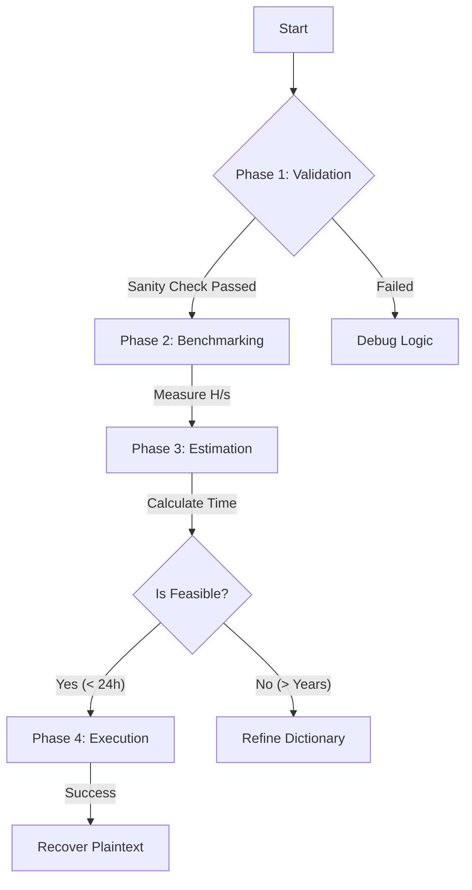

# PBKDF2 & AES Cracker: Cryptographic Vulnerability Analysis

> **University Project | Data Security Systems Laboratory**
> **MSc in Computer Engineering**
> A structured, methodological approach to analyzing and exploiting weak password policies in a secure symmetric encryption scheme using Python.

| Info | Details |
| :--- | :--- |
| **👤 Author** | **Giovanni Del Bianco** |
| **🐍 Language** | **Python 3.8+** |
| **🔐 Libraries** | `cryptography` (Fernet, PBKDF2HMAC, SHA256) |
| **🧠 Key Concepts** | **Symmetric Encryption**, **Key Derivation Functions (KDF)**, **Dictionary Attacks**, **Computational Complexity**, **Salt & Rainbow Tables**. |
| **🎯 Goal** | Audit a secure system, perform a benchmarked brute-force attack, and recover the plaintext from a captured ciphertext. |

---

## 🚨 The Scenario: Mission Briefing

### 1. The Intercepted Data
In this laboratory scenario, we assume the role of a security analyst (or an adversary) who has intercepted encrypted traffic. We have obtained two critical pieces of data:
1.  **Ciphertext:** A base64-encoded string representing the encrypted message.
2.  **Salt:** A 16-byte random sequence used during the key generation process.

> **⚠️ Crucial Security Note:** The **Salt** is *not* a secret. It is stored in plaintext alongside the ciphertext. Its primary cryptographic purpose is to ensure uniqueness: two users with the same password will generate different keys. This effectively neutralizes pre-computed attacks like **Rainbow Tables**, forcing the attacker to derive the key from scratch for *this specific target*.

### 2. The Cryptographic Protocol (The Target)
Preliminary analysis of the target system reveals a robust, industry-standard implementation based on the `cryptography` Python library. The system does not rely on "security through obscurity" but uses strong primitives:

*   **Encryption Scheme:** **Fernet** (Symmetric Authenticated Encryption).
    *   *Under the hood:* It uses **AES-128** in CBC mode with PKCS7 padding for confidentiality and **HMAC-SHA256** for message integrity and authentication.
*   **Key Derivation Function (KDF):** **PBKDF2-HMAC-SHA256**.
    *   *Purpose:* Transforms a low-entropy password (human-readable) into a high-entropy 32-byte cryptographic key.
    *   *Work Factor:* **100,000 Iterations**. This is the defense mechanism. It deliberately slows down the key generation process (Key Stretching), making brute-force attacks computationally expensive.

### 3. Threat Model & Intelligence
We are not performing a blind brute-force attack (which would take eons). We have **intelligence** on the target's password policy. We know the password is constructed using a specific pattern:

| Component | Rule | Example |
| :--- | :--- | :--- |
| **Base Word** | A word from a known, small dictionary (e.g., `password`, `sicurezza`, `gatto`). | `gatto` |
| **Capitalization** | Exactly **one** letter in the word is capitalized. | `Gatto`, `gaTto` |
| **Number** | A single digit (0-9) is inserted at **any** position. | `Ga1tto` |
| **Symbol** | A special char (`! $ % & ? ^ * + @ #`) is inserted at **any** position. | `Ga1tto$` |

**The Objective:** Leverage this intelligence to reduce the search space to a manageable size, calculate the necessary computational time, and recover the original password.

## 🧠 The Engineering Approach

### "Measure Twice, Cut Once"
Cryptographic attacks are computationally expensive. A naive brute-force script against a key derivation function like **PBKDF2 (100,000 iterations)** can take years if the search space is not properly bounded. Furthermore, debugging a decryption failure during a live attack is impossible because the "correct" result is unknown.

To address these challenges, I adopted a strict **four-phase engineering methodology**, treating the attack as a software development lifecycle rather than a simple script execution.

### 🏗️ Attack Pipeline
The project is structured into distinct logical phases to minimize risk and maximize efficiency:



### 🔬 Methodology Breakdown

1.  **Phase 1: Logic Validation (Sanity Check)**
    *   **The Problem:** How do we know our cracker works if we don't know the password?
    *   **The Solution:** Create a *Controlled Test Case*. I wrote a script to encrypt a known message with a known password (`giovanni0@`) using the exact same parameters as the target. If my decryption tool works on this "dummy target", the logic is sound.

2.  **Phase 2: Performance Profiling**
    *   **The Problem:** PBKDF2 is designed to be slow. How fast is *my* specific hardware?
    *   **The Solution:** I developed a benchmarking tool to measure the **Hash Rate (H/s)**. This metric is the "velocity" of our attack.

3.  **Phase 3: Complexity Analysis**
    *   **The Problem:** Is the attack feasible? Will it take 2 hours or 20 years?
    *   **The Solution:** Using Combinatorics, I calculated the exact size of the **Key Space** (total possible passwords) based on the threat intelligence rules. By dividing the Key Space by the Hash Rate, I obtained a precise Time-to-Crack estimate.

4.  **Phase 4: Optimized Execution**
    *   **The Problem:** Memory management. Generating a list of 40 million passwords in RAM will crash the system.
    *   **The Solution:** I implemented a **Python Generator** (`yield`) to produce password candidates on-the-fly, keeping memory usage constant ($O(1)$) regardless of the dictionary size.

## 🔬 Phase 1: Logic Validation (Sanity Check)

### The Problem: Debugging the Unknown
The primary challenge in any cryptographic attack is the **lack of feedback**. When a decryption attempt fails, the system (correctly) returns an error. But *why* did it fail?
1.  **Wrong Password?** (Most likely)
2.  **Bug in the Cracker Logic?** (Possible: maybe the salt encoding is wrong?)
3.  **Library Misuse?** (e.g., wrong padding or IV handling?)

If we attack the real target immediately and fail, we cannot distinguish between Case 1 and Case 2. We need a **Ground Truth**.

### The Solution: A Controlled Test Case
Before touching the real data, I developed a "Mirror Environment" (`Fase1_create_test_case.py`).
*   **Goal:** Encrypt a known message (`"If you read this..."`) with a known password (`"giovanni0@"`).
*   **Parameters:** I replicated the *exact* cryptographic parameters of the challenge:
    *   **Algorithm:** PBKDF2-HMAC-SHA256
    *   **Iterations:** 100,000
    *   **Key Length:** 32 bytes (256 bits)

### 🛠️ Key Implementation Detail: The Decryption Oracle
The core of the attack script relies on the `try-except` block provided by the `cryptography` library. This acts as our **Oracle**: it tells us *valid* vs *invalid* key.

```python
def decrypt(passwd_bytes):
    """
    Attempts to decrypt the ciphertext using a candidate password.
    Returns True if successful, False if the key is invalid.
    """
    try:
        # 1. Derive the Key (Computationally Expensive Step)
        kdf = PBKDF2HMAC(
            algorithm=hashes.SHA256(),
            length=32,
            salt=salt,          # The fixed salt from the challenge
            iterations=100000,  # Work Factor
        )
        key = base64.urlsafe_b64encode(kdf.derive(passwd_bytes))
        
        # 2. Attempt Decryption (Authenticated Encryption Check)
        f = Fernet(key)
        plaintext = f.decrypt(ciphertext)
        
        # Success!
        print(f"[SUCCESS] PASSWORD FOUND: {passwd_bytes.decode('utf-8')}")
        return True
        
    except InvalidToken:
        # Failure: The MAC check failed (Wrong Key -> Wrong Password)
        return False
```

> **Why this works:** Fernet uses **HMAC (Hash-based Message Authentication Code)** to verify integrity. If the key is wrong, the HMAC check fails instantly, raising `InvalidToken`. This is the cryptographic signal we are listening for.

### ✅ Result
By running `Fase1_bruteforce_test.py` against my generated test case, I confirmed that the logic was sound. The script successfully recovered `"giovanni0@"`. **The tool is now validated and ready for the real target.**

## ⏱️ Phase 2: Performance Profiling

### The Bottleneck: Key Stretching
Modern password hashing algorithms like **PBKDF2** (Password-Based Key Derivation Function 2) are specifically designed to be slow. They employ a technique called **Key Stretching**, repeating the hashing process thousands of times.
*   **Target:** 100,000 Iterations.
*   **Result:** Deriving a single key from a password takes ~100,000 times longer than a simple SHA-256 hash.

This deliberate slowness is the primary defense against brute-force attacks. Before launching a full-scale assault, I needed to quantify this cost on my specific hardware.

### 📊 Benchmark Results (`Fase2_benchmark.py`)
I developed a benchmarking tool to measure the **Hash Rate (H/s)**—the number of passwords my system can test per second.

| Metric | Value |
| :--- | :--- |
| **Test Sample Size** | 1,000 Passwords |
| **Total Duration** | ~17.20 seconds |
| **Hash Rate (Velocity)** | **~58.13 H/s** |

> **Key Takeaway:** My system can only test **~58 passwords per second**.
> This number is the "velocity" of my attack. Without it, any estimate of the attack duration would be pure guesswork.

### The Cost of Encryption
Unlike cracking an MD5 hash (billions of attempts/sec), cracking PBKDF2 is computationally expensive.
*   **CPU Impact:** Each attempt consumes significant CPU cycles to compute `HMAC-SHA256` 100,000 times.
*   **Parallelism:** While Python's GIL (Global Interpreter Lock) limits multi-threading, the `cryptography` library releases the GIL for heavy C-level operations (like OpenSSL calls), allowing some degree of concurrency. However, for simplicity and stability, this project uses a single-threaded approach.

**Armed with this speed metric (58.13 H/s), I could proceed to the next phase: Calculating the feasibility of the attack.**


## 🧮 Phase 3: Complexity Analysis & Estimation

### Defining the Search Space
To ensure the attack finishes within a reasonable timeframe (e.g., < 24 hours), I needed to calculate the exact size of the **Search Space** ($N$). This is a combinatorial problem.

**The Rules (from Intelligence):**
1.  **Dictionary:** 10 words (`gatto`, `giulia`, `password`, `sicurezza`, etc.).
2.  **Capitalization:** 1 letter is capitalized. ($W_{len}$ variants per word).
3.  **Number:** 1 digit inserted at any position ($W_{len} + 1$).
4.  **Symbol:** 1 symbol inserted at any position ($W_{len} + 2$).

### ➗ Combinatorial Formula
For each word $w$ of length $L$, the number of combinations $C_w$ is calculated as:

$$ C_w = \underbrace{L}_{\text{Capitalization}} \times \underbrace{(10 \times (L+1))}_{\text{Digit Insertion}} \times \underbrace{(10 \times (L+2))}_{\text{Symbol Insertion}} $$

**Example: "password" ($L=8$)**
*   **Capitalization:** 8 variants (`Password`, `pAssword`, ...).
*   **Digit:** 10 digits × 9 positions = 90 variants.
*   **Symbol:** 10 symbols × 10 positions = 100 variants.
*   **Total for "password":** $8 \times 90 \times 100 = \mathbf{72,000}$ combinations.

### 📉 Estimation Results (`Fase4_final_calculator.py`)
By applying this formula to all 10 dictionary words, I calculated the total search space and estimated the attack duration using my measured speed (**58.13 H/s**).

| Metric | Calculation | Result |
| :--- | :--- | :--- |
| **Total Combinations ($N$)** | $\sum C_w$ for all 10 words | **422,400** |
| **Attack Speed ($V$)** | From Phase 2 | **58.13 H/s** |
| **Worst-Case Time ($T_{max}$)** | $N / V$ | **~2.02 Hours** |
| **Average-Case Time ($T_{avg}$)** | $T_{max} / 2$ | **~1.01 Hours** |

> **Conclusion:** The attack is **highly feasible**.
> With a maximum duration of ~2 hours on consumer hardware, a brute-force approach against this specific password policy is a valid strategy.

## 🚀 Phase 4: Optimized Execution (The Attack)

### 🛠️ Engineering the Solution: Memory Efficiency
A naive implementation would generate a list of all 422,400 passwords and iterate through them. While feasible for this small dataset, this approach scales poorly ($O(N)$ space complexity).

For the final script (`Fase5_cracker.py`), I implemented a **Python Generator** using the `yield` keyword.
*   **Strategy:** Lazy Evaluation.
*   **Benefit:** Passwords are generated, tested, and discarded one by one. The memory footprint remains constant ($O(1)$), regardless of whether the dictionary has 10 words or 10 million.

```python
def password_generator(dictionary):
    """
    Yields one password candidate at a time.
    Memory usage: Constant (O(1)).
    """
    for base_word in dictionary:
        # ... logic for capitalization ...
        for symbol in symbols:
            # ... logic for insertion ...
            for number in numbers:
                # Construct final candidate
                yield final_password 
```

### ⚔️ Attack Execution
I configured the cracker to run in `FULL_ATTACK` mode against the target ciphertext.

*   **Target:** Real Ciphertext (from `Appunti.md`).
*   **Dictionary:** Full list (10 words).
*   **Feedback:** The script provided real-time status updates every 5,000 attempts to monitor the progress against the estimated timeline.

### 🏆 Final Results
The attack was successful. The system recovered the plaintext significantly faster than the "Worst Case" estimate, proving the effectiveness of the targeted dictionary approach.

```text
============================================================
[INFO] Starting Cracker...
[INFO] Running in FULL ATTACK mode.
============================================================
[INFO] Progress: 5,000 attempts  | Speed: 52.86 H/s | Last test: 'Sicur4?ezza'       
[INFO] Progress: 10,000 attempts  | Speed: 54.31 H/s | Last test: '9#Sicurezza'
...
============================================================
[!!!] SUCCESS! PASSWORD FOUND [!!!]
 -> Password:  sicur@e8Zza
 -> Plaintext: congratulations, you have decrypted the message correctly. Now you should have found the password used to encrypt!
============================================================


============================================================
Attack Summary
============================================================
[RESULT] SUCCESS: The password was found and the message decrypted.
Total passwords tested: 75,446
Total time taken: 20.52 minutes (1230.97 seconds).
============================================================
```

> **🎉 Mission Accomplished:** 
> The encrypted message was successfully decrypted. The content was:
"congratulations, you have decrypted the message correctly. Now you should have found the password used to encrypt!"


## 🎓 Key Takeaways & Security Analysis

This laboratory exercise highlighted critical concepts in modern applied cryptography:

1.  **Complexity vs. Entropy:**
    The password policy (*"Must contain 1 uppercase, 1 number, 1 symbol"*) appeared robust on paper. However, because the **base entropy** was low (a dictionary word), the effective search space remained small (~400k combinations).
    > **Lesson:** A complex password based on a common word is weaker than a simple, long random passphrase (e.g., `correct-horse-battery-staple`).

2.  **The Role of Computational Cost (Work Factor):**
    The use of **PBKDF2 with 100,000 iterations** was the system's strongest defense. It slowed the attack from potentially millions of attempts per second (with MD5) to just ~58 attempts per second.
    > **Lesson:** For defenders, increasing the iteration count (Work Factor) is the most effective way to mitigate brute-force attacks as hardware becomes faster.

3.  **Methodology Over Tools:**
    The success of this project relied less on the Python code itself and more on the **Engineering Approach**.
    > **Lesson:** Validating logic (`sanity check`), measuring performance (`benchmark`), and estimating feasibility (`math`) prevented wasted time and ensured a deterministic outcome.

---

## 📂 Repository Structure

```text
PBKDF2-Cracker/
├── Fase1_create_test_case.py   # [Validation] Generates a dummy target to test logic
├── Fase1_bruteforce_test.py    # [Validation] Decrypts the dummy target (Sanity Check)
├── Fase2_benchmark.py          # [Profiling] Measures Hash Rate (H/s) on local hardware
├── Fase4_final_calculator.py   # [Estimation] Calculates search space & time-to-crack
├── Fase5_cracker.py            # [Execution] The final optimized generator-based attack
├── README.md                   # Project Documentation
└── Hands-on Brute Force.pdf    # Laboratory text
```


## 🛠️ How to Run

### Prerequisites
*   **Python 3.8+**
*   **Pip** (Python Package Manager)

### Installation
1.  Clone the repository:
    ```bash
    git clone https://github.com/Giovanni-Del-Bianco/PBKDF2-AES-Security-Analysis.git
    cd PBKDF2-AES-Security-Analysis
    ```
2.  Install the required cryptographic library:
    ```bash
    pip install cryptography
    ```

### Execution Steps
1.  **Run the Sanity Check:** Verify your environment works.
    ```bash
    python Fase1_bruteforce_test.py
    ```
2.  **Benchmark your Hardware:** See how fast your CPU is.
    ```bash
    python Fase2_benchmark.py
    ```
3.  **Launch the Attack:** Run the final cracker.
    ```bash
    python Fase5_cracker.py
    ```

## ⚠️ Disclaimer
This project is for **educational purposes only**. It was developed as part of the *Data Security Systems* laboratory at the University of [Name]. The techniques demonstrated here should only be used on systems you own or have explicit permission to test.


## 📜 License

This project is released under the MIT License. For full details, please consult the LICENSE file included in the repository.


